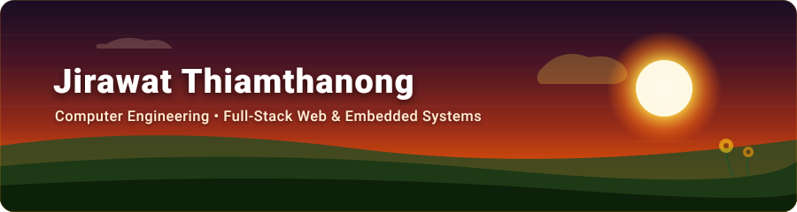

<div align="center">

  

  <p align="center">
    <a href="https://github.com/firstphethay11"></a>
    <a href="https://www.linkedin.com/in/phethay-genko-602261427/"></a>
    <a href="mailto:nongfirst.aoy@gmail.com"></a>
    
  </p>

</div>

---

### 01. Overview

Computer Engineering student at **Rajamangala University of Technology Isan (RMUTI)**.  
Focused on practical software engineering: building production-ready full-stack web applications and programming microcontrollers for real-world automation.

---

### 02. Real Projects & Repos

#### [RMUTI Dormitory System (Demo Prototype)](https://github.com/firstphethay11/rmuti-dormitory)
> **Full-Stack Student Dormitory & Maintenance Repair Platform**  
> `React 19` • `Tailwind v4` • `Express 5` • `MySQL 8.4` • `Docker` • `Socket.IO`

- Web-based maintenance ticketing platform with a role-switching demo environment (Students, Technicians, Admin).
- Features real-time repair status updates, secure JWT/CSRF authentication, and Dockerized deployment.

#### [IoT & Microcontroller Systems](https://github.com/firstphethay11/iot-microcontroller-coursework)
> **Hardware Interfacing, Embedded Control & Cloud Automation**  
> `ESP32` • `MicroPython` • `Arduino C++` • `Firebase` • `I2C / UART`

- Dual-zone temperature & scheduled timer controller with DS3231 precision RTC, 20x4 I2C LCD, and relay automation.
- Cloud-connected DC motor PWM controller synced via Firebase Realtime Database and a web dashboard.

#### [Mobile Application Development](https://github.com/firstphethay11/flutter-mobile-coursework)
> **Cross-Platform Mobile Apps Coursework**  
> `Flutter` • `Dart` • `REST APIs` • `Android`

- Cross-platform engineering coursework covering Flutter reactive state, mobile OS Quick Settings UI simulation, and Material 3 patterns.
- Hardware device integration: camera viewfinder with haptic shutter, GPS geolocation, and Google Maps routing to Ya Mo Monument.
- RESTful networking (COVID-19 Situation Dashboard), dynamic student roster form management, and local file persistence.

#### [Web Development Coursework](https://github.com/firstphethay11/web-dev-coursework)
> **Web Application Engineering Labs & Exams**  
> `Node.js` • `Express` • `Tailwind CSS` • `MySQL`

- Coursework covering responsive design layouts, modern web fundamentals, and REST API services.

#### [Louis Vuitton E-Commerce Simulation](https://github.com/firstphethay11/louis-vuitton-fullstack)
> **Educational Luxury E-Commerce Architecture Simulation**  
> `JavaScript` • `Express` • `MySQL`

- Full-stack e-commerce simulation exploring product catalogs, shopping cart state, and backend API data flows.

---

### 03. Tech Stack (In Actual Use)

<p align="left">
  
</p>

---

### 04. Contact

```text
GitHub    : https://github.com/firstphethay11
LinkedIn  : https://www.linkedin.com/in/phethay-genko-602261427/
Email     : nongfirst.aoy@gmail.com
Location  : Nakhon Ratchasima, Thailand
```

<div align="center">
  <sub>Warm tones &amp; clean code. Built by Jirawat Thiamthanong.</sub>
</div>