  

  

    
    
    
    
  

---

### 01. Overview

---

### 02. Real Projects & Repos

<table width="100%">
  <tr>
    <td width="50%" valign="top">
      
        
      <b>Student Dormitory &amp; Maintenance Platform</b> 
      <code>React 19</code> &bull; <code>Tailwind v4</code> &bull; <code>Express 5</code> &bull; <code>Docker</code>
      

        Online maintenance ticketing platform featuring a multi-role simulation environment and real-time repair status tracking.
      

    </td>
    <td width="50%" valign="top">
      
        
      <b>Hardware Interfacing &amp; Embedded Automation</b> 
      <code>ESP32</code> &bull; <code>MicroPython</code> &bull; <code>Arduino C</code> &bull; <code>Firebase</code>
      

        Dual-zone temperature/timer controller with RTC &amp; LCD, plus cloud-connected DC motor control via Firebase Realtime Database.
      

    </td>
  </tr>
  <tr>
    <td width="50%" valign="top">
      
        
      <b>Cross-Platform Mobile Apps Coursework</b> 
      <code>Flutter</code> &bull; <code>Dart</code> &bull; <code>REST APIs</code> &bull; <code>Android</code>
      

        Practical mobile application coursework covering reactive state, device hardware integration, and RESTful API services.
      

    </td>
    <td width="50%" valign="top">
      
        
      <b>Web Application Engineering Labs &amp; Exams</b> 
      <code>Node.js</code> &bull; <code>Express</code> &bull; <code>Tailwind CSS</code> &bull; <code>MySQL</code>
      

        Coursework and practical exams covering modern responsive web design, frontend UI components, and backend REST APIs.
      

    </td>
  </tr>
  <tr>
    <td width="50%" valign="top">
      
        
      <b>Educational Luxury E-Commerce Simulation</b> 
      <code>JavaScript</code> &bull; <code>Express</code> &bull; <code>MySQL</code>
      

        Full-stack e-commerce simulation exploring dynamic product catalogs, persistent shopping cart state, and backend API flows.
      

    </td>
    <td width="50%" valign="top">
      
        
      <b>AI &amp; Operating Systems Coursework</b> 
      <code>TensorFlow</code> &bull; <code>Keras</code> &bull; <code>NumPy</code> &bull; <code>OS Algorithms</code>
      

        Deep Learning CNN binary image classification alongside Dijkstra's Banker's Algorithm deadlock avoidance simulation.
      

    </td>
  </tr>
</table>

---

### 03. Tech Stack (In Actual Use)

<table align="center" width="100%">
  <tr>
    <td align="center" width="50%" valign="top">
      
<b>Web &amp; Frontend</b>

      
    </td>
    <td align="center" width="50%" valign="top">
      
<b>Mobile Apps</b>

      
    </td>
  </tr>
  <tr>
    <td align="center" width="50%" valign="top">
      
<b>Embedded &amp; IoT</b>

      
    </td>
    <td align="center" width="50%" valign="top">
      
<b>DevOps &amp; Cloud</b>

      
    </td>
  </tr>
</table>

---

### 04. Contact

<table width="100%">
  <tr>
    <td width="50%" valign="top">
      
    </td>
    <td width="50%" valign="top">
      
    </td>
  </tr>
  <tr>
    <td width="50%" valign="top">
      
    </td>
    <td width="50%" valign="top">
      
    </td>
  </tr>
</table>

 

  Warm tones &amp; clean code. Built by Jirawat Thiamthanong.

